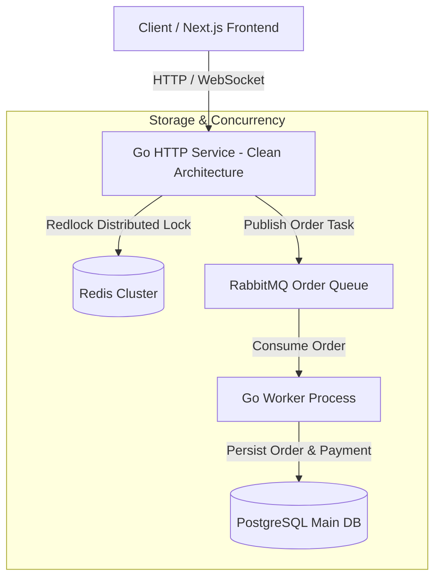

# 🎟️ Flash-Sale & Ticket Booking System Engine

Sistem pemesanan tiket dengan performa tinggi (*high concurrency*), penanganan *race conditions* menggunakan **Distributed Mutex (Redis)**, dan pemrosesan antrean asynchronous menggunakan **RabbitMQ**.

Didesain dengan arsitektur **Monorepo** yang rapi, memisahkan backend sistem berarsitektur *Clean Architecture* (Go) dan aplikasi antarmuka pengguna (Next.js - Fase 2).

---

## 🏛️ System Architecture



---

## 📁 Monorepo Layout

```
ticket-booking-engine/
├── apps/
│   ├── backend/         # Go Clean Architecture (API & Worker)
│   └── frontend/        # Next.js App (Fase 2)
├── docker/              # Infrastructure Configuration
├── scripts/             # K6 Load Test Scripts
├── docker-compose.yml   # Local Postgres, Redis, RabbitMQ
└── Makefile             # Developer Commands
```

---

## 🚀 Quick Start (Local Setup)

### Option A: Menggunakan Command Langsung (Windows CMD / PowerShell)
```cmd
# 1. Jalankan Infrastruktur Lokal (Docker)
docker compose up -d

# 2. Jalankan Backend Server (Go)
cd apps\backend
go run cmd\api\main.go

# 3. Jalankan Worker Asynchronous
cd apps\backend
go run cmd\worker\main.go
```

### Option B: Menggunakan Helper Script Windows (`run.bat`)
```cmd
.\run.bat docker-up
.\run.bat backend-run
.\run.bat test
```

### Option C: Menggunakan `make` (Linux / Mac / WSL / Git Bash)
```bash
make docker-up
make backend-run
```

---

## 🧪 Testing & Benchmarking
Untuk menguji batas ketahanan sistem terhadap *race condition* dan *traffic spike*:
```bash
make load-test
```
